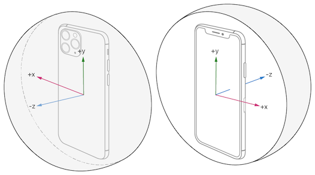
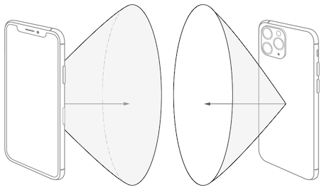
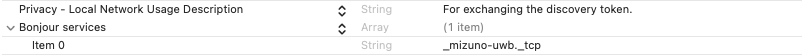
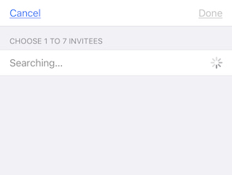
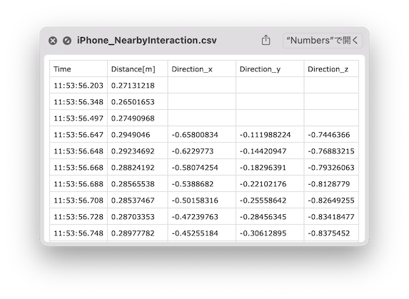

# 【Swift】Nearby Interactionを用いたiPhone間の距離と方向を取得するアプリ
## はじめに
「iPhoneとiPhone間」と「AppleWatchとiPhone間」の距離と方向をリアルタイムで取得するアプリを作成しましたので、実装方法を説明したいと思います。
下記のgifは、iPhoneを固定しApple Watchを対角線3mの星形をなぞった際の取得データを、別途可視化したものです。    
ソースコードは、こちらの[iPhoneとiPhone間アプリ](https://github.com/MIZUNO-CORPORATION/NearbyInteractionByMultipeerConnectivity)と[AppleWatchとiPhone間アプリ](https://github.com/MIZUNO-CORPORATION/NearbyInteractionByCoreBluetooth)の2種類になります。  
使用するフレームワークは[Nearby Interaction](https://developer.apple.com/documentation/nearbyinteraction)で、室内でデバイス間30m程度を数cmの精度で50Hzでデータを取得することができました。  
このフレームワークは、U1チップを搭載しているiPhone 11とApple Watch 6以降のデバイスかつiOS 14以降で使用可能です。U1チップで使われている超広帯域無線（UWB）という技術は[こちらの記事](https://wired.jp/2020/06/21/u1-chip-future-of-apple-6/)で詳しく説明されており、ARでも活用が期待されているようです。


## 取得できる情報
1. [`distance`](https://developer.apple.com/documentation/nearbyinteraction/ninearbyobject/3601348-distance)
   - `Float?`：デバイス間の距離がメートル単位で取得される
   - 距離が離れたり障害物があり取得できない場合、`nil`となる
   - アプトプット例：3.553371

1. [`direction`](https://developer.apple.com/documentation/nearbyinteraction/ninearbyobject/3601347-direction)
   - `simd_float3?`：相手のデバイスの方向が、正規化された３次元で取得される（上図）
   - 相手がApple Watchの場合は、取得できず`nil`になる
   - 方向を取得するためには、相手のデバイスが一定の範囲にある必要がある（下図）
   - アウトプット例：SIMD3<Float>(-0.3952641, 0.07060665, -0.91584986)
   
1. [`discoveryToken`](https://developer.apple.com/documentation/nearbyinteraction/ninearbyobject/3601162-discoverytoken)
   - `NIDiscoveryToken`：交換した相手のトークンのIDが取得される
   - 複数台同時にデータを取得する場合は、このIDで区別する
   - アウトプット例：E30B...200D

ドキュメントでは、距離は9m以内と記載がありますが、30m離れても検出可能でした。  
また取得できるサンプリングレートは50Hz程度でした。

  
取得される方向の3次元座標系（[出典](https://developer.apple.com/documentation/nearbyinteraction/ninearbyobject/3601347-direction)）  


  
方向が検出可能な範囲（[出典](https://developer.apple.com/documentation/nearbyinteraction/initiating_and_maintaining_a_session)）  


## 距離と方向の検出の流れ
1. `NISession`のインスタンスを作成する
1. 接続するデバイス間で、`descoveryToken`を交換し合う
1. `NINearbyPeerConfiguration`で、相手のトークンを設定する
1. `NISession`を開始する
1. `NISessionDelegate`で、`NINearbyObject`（相手の距離や方向の情報）を受け取る

検出までの流れはNearby Interactionのフレームワークによりシンプルです。  
しかし、2.のトークンの交換には別のネットワーク技術を活用しなければならなく、しかもヘビーで、実装の大部分がこちらになります。   
今回、下記のネットワークを使用しました。
- iPhoneとiPhone間アプリ：[Multipeer Connectivity](https://developer.apple.com/documentation/multipeerconnectivity)
- AppleWatchとiPhone間アプリ：[Core Bluetooth](https://developer.apple.com/documentation/corebluetooth)

## フレームワークのインポート
### 共通
距離と方向を取得するために、`NearbyInteraction`をインポートします。 
```swift
import NearbyInteraction
``` 
### Multipeer Connectivityでトークンを交換する場合
今回は、iPhoneとiPhone間アプリに、追加で`MultipeerConnectivity`をインポートしました。
```swift
import MultipeerConnectivity
```

### Core Bluetoothでトークンを交換する場合
今回は、Apple WatchとiPhone間アプリに、追加で`CoreBluetooth`をインポートしました。
```swift
import CoreBluetooth
```

## Info.plistの記述
### 共通
`NearbyInteraction`を使用するために、`Privacy - Nearby Interaction Usage Description`を追加し、使用目的を記入します。この内容がアプリを立ち上げた初回にポップアップで表されます。


### Multipeer Connectivityでトークンを交換する場合
`MultipeerConnectivity`を使用するために、`Privacy - Local Network Usage Description`を追加し、使用目的を記入します。この内容がアプリを立ち上げた初回にポップアップで表されます。  
さらに、ローカルネットワークを使用するために`Bonjour sevices`を追加し、アイテムに`_○○○._tcp`を記述します。`○○○`は、ソースコード上の`serviceType`と一致させる必要があります。


```swift
mcServiceType = "○○○"
MCBrowserViewController(serviceType: mcServiceType, session: mcSession!)
```

### Core Bluetoothでトークンを交換する場合
`CoreBluetooth`を使用するために、`Privacy - Bluetooth Always Usage Description`を追加し、使用目的を記入します。この内容がアプリを立ち上げた初回にポップアップで表されます。 


## 実装方法
### 1. `NISession`のインスタンスを作成する
Nearby Interactionで使用する変数を宣言します。  
今回、Core Bluetoothでトークンを交換するPhoneアプリはiPhoneTokenData、Apple WatchアプリはappleWatchDataと変数名をしています。

```swift
var niSession: NISession?
var myTokenData: Data? 
```

Nearby Interactionフレームワークが対応しているか`NISession.isSupported`で確認します。  
`NISession`のインスタンスを作成し、距離や方向のデータを取得するために`delegate`も設定します。  
自分のトークンを相手に送るために、`Data`型に変更します。

```swift
// Check if Nearby Interaction is supported.
guard NISession.isSupported else {
    print("This device doesn't support Nearby Interaction.")
    return
}

// Set the NISession.
niSession = NISession()
niSession?.delegate = self

// Create a token and change Data type.
guard let token = niSession?.discoveryToken else {
    return
}
myTokenData = try! NSKeyedArchiver.archivedData(withRootObject: token, requiringSecureCoding: true)
```

### 2. 接続するデバイス間で、`descoveryToken`を交換し合う
#### Multipeer Connectivityでトークンを交換する場合
1. Multipeer Connectivityで使用する変数を宣言します。  
ローカルネットワークでTCP接続をするために、`serviceType`をInfo.plistの`Bonjour sevices`のアイテムに記入した`_○○○._tcp`と一致させます。  
Multipeer Connectivityで、相手に検索してもらうために、`displayName`にデバイス名を設定します。

    ```swift
    var mcSession: MCSession?
    var mcAdvertiser: MCNearbyServiceAdvertiser?
    var mcBrowserViewController: MCBrowserViewController?
    let mcServiceType = "○○○"
    let mcPeerID = MCPeerID(displayName: UIDevice.current.name)
    ```

1. 相手に検索してもらうために、アドバタイザ側の設定と開始をします。  
検索され接続を要求された時のために、`delegate`も設定します。
    ```swift
    mcAdvertiser = MCNearbyServiceAdvertiser(peer: mcPeerID, discoveryInfo: nil, serviceType: mcServiceType)
    mcAdvertiser?.delegate = self
    mcAdvertiser?.startAdvertisingPeer()
    ```

    一方、相手を検索するために、ブラウザ側の設定と開始をします。  
    ブラウザの設定方法は複数ありますが、MCBrowserViewControllerを使用すると下図のようなUI画面が作成されるので便利そうです。  
    相手を検索してViewControllerに反映するために、`delegate`も設定します。
    ```swift
    mcSession = MCSession(peer: mcPeerID)
    mcSession?.delegate = self
    mcBrowserViewController = MCBrowserViewController(serviceType: mcServiceType, session: mcSession!)
    mcBrowserViewController?.delegate = self
    present(mcBrowserViewController!, animated: true)
    ```
    

1. 検索され接続を要求された時に、`MCNearbyServiceAdvertiserDelegate`の下記のメソッドが呼ばれます。  
    要求を許可するために`invitationHandler`で`true`を返します。
    ```swift
    extension ViewController: MCNearbyServiceAdvertiserDelegate {
    func advertiser(_ advertiser: MCNearbyServiceAdvertiser, didReceiveInvitationFromPeer peerID: MCPeerID, withContext context: Data?, invitationHandler: @escaping (Bool, MCSession?) -> Void) {
        invitationHandler(true, mcSession)
        }
    }
    ```
    一方、相手を検索して見つけると、`MCBrowserViewControllerDelegate`の下記のメソッドが呼ばれ、`true`を返すとViewControllerに反映されます。  
    表示されたデバイス名をタップすると、接続を要求します。
    ```swift
    extension ViewController: MCBrowserViewControllerDelegate {
        func browserViewController(_ browserViewController: MCBrowserViewController, shouldPresentNearbyPeer peerID: MCPeerID, withDiscoveryInfo info: [String : String]?) -> Bool {
            return true
        }
    }
    ```


1. 接続が完了すると、`MCSessionDelegate`の下記のメソッドが呼ばれ、`MCSessionState`が`.conneted`になります。  
    `MCSession.send()`により、`Data`型の自分のトークンを相手に送ります。

    ```swift
    extension ViewController: MCSessionDelegate {
        func session(_ session: MCSession, peer peerID: MCPeerID, didChange state: MCSessionState) {
            switch state {
            case .connected:
                
                do {
                    try session.send(data, toPeers: session.connectedPeers, with: .reliable)

                } catch {
                    print(error.localizedDescription)
                }
                
            default:
                print("MCSession state is \(state)")
            }
        }
    }
    ```

    一方、相手からのトークンを受け取ると、`MCSessionDelegate`の下記のメソッドが呼ばれ、トークンが`Data`型になっています。  
    `NSKeyedUnarchiver.unarchivedObject()`によりトークンを`NSObject`型に戻します。  
    ```swift
    extension ViewController: MCSessionDelegate {
        func session(_ session: MCSession, didReceive data: Data, fromPeer peerID: MCPeerID) {
            
            guard let peerDiscoverToken = try? NSKeyedUnarchiver.unarchivedObject(ofClass: NIDiscoveryToken.self, from: data) else {
                print("Failed to decode data.")
                return }
                
            // 3. Configure the received token.
            let config = NINearbyPeerConfiguration(peerToken: peerDiscoverToken)
            // 4. Start the NISession.
            niSession?.run(config)
        }
    }
    ```

#### Core Bluetoothでトークンを交換する場合
Apple WatchのアプリをCentralモード、iPhoneのアプリをPeripheralモードとしました。今回、UUIDは、Macのターミナルの`uuidgen`コマンドで生成したランダムなIDとしました。  
双方に共通なServiceとCharacteristicのUUIDを設定します。今回、Characteristicは、「Apple WatchからiPhoneにトークンを書き込むWrite用」と「iPhoneからApple Watchにトークンを読み込むRead用」の２つを設定しました。
```swift
let tokenServiceUUID: CBUUID = CBUUID(string:"2AC0B600-7C0C-4C9D-AB71-072AE2037107")
let appleWatchTokenCharacteristicUUID: CBUUID = CBUUID(string:"2AC0B601-7C0C-4C9D-AB71-072AE2037107") 
let iPhoneTokenCharacteristicUUID: CBUUID = CBUUID(string:"2AC0B602-7C0C-4C9D-AB71-072AE2037107")
```

##### Apple Watchのアプリ（Central）の実装
1. Centralで使用する変数を宣言します。  
    Central（Apple Watch側）を管理するマネージャと接続するPeripheral（iPhone側）の変数を宣言します。
    ```swift
    var centralManager: CBCentralManager!
    var discoveredPeripheral: CBPeripheral!
    ```
1. Centralを管理するマネージャの設定をします。
    状態の変化を受け取るため時のために、`delegate`も設定します。
    ```swift
    centralManager = CBCentralManager(delegate: self, queue: nil)
    ```
1. Centralの状態を受け取ると、`CBCentralManagerDelegate`の下記の上のメソッドが呼ばれます。BluetoothがONになっている場合は`.poweredOn`となります。  
    ONならば、`central.scanForPeripherals()`で、`tokenServiceUUID`と同じIDをアドバタイズしているPeripheralを探します。  
    Periphralが見つかると、真ん中のメソッドが呼ばれます。見つかったPeripharalを`discoveredPeripheral`変数に保持します。Centralは探すのを止め、見つけたPeripharalと接続を開始します。  
    接続が完了すると、下のメソッドが呼ばれます。Peripheralの状態を受け取るために、`delegate`を設定し、Peripheralが保持しているServiceを検索します。
    ```swift  
    extension InterfaceController: CBCentralManagerDelegate{
        func centralManagerDidUpdateState(_ central: CBCentralManager) {
            switch central.state {
            case .poweredOn:
                print("CBManager state is powered on")
                central.scanForPeripherals(withServices: [tokenServiceUUID])
                
            default:
                print("CBManager state is \(central.state)")
            }
        }
        
        func centralManager(_ central: CBCentralManager, didDiscover peripheral: CBPeripheral,
                            advertisementData: [String: Any], rssi RSSI: NSNumber) {
            discoveredPeripheral = peripheral
            central.stopScan()
            central.connect(peripheral, options: nil)
        }
        
        func centralManager(_ central: CBCentralManager, didConnect peripheral: CBPeripheral) {
            peripheral.delegate = self
            peripheral.discoverServices([tokenServiceUUID])
        }
    }
    ```
1. Serviceを見つけると、`CBPeripheralDelegate`の下記の上のメソッドが呼ばれます。次に、Serviceの中に含まれているCharacteristicを探します。  
    Characteristicを見つけると、真ん中のメソッドが呼ばれます。Characteristicの中で、Apple Watch側のトークンをWriteコマンドでiPhone側に送信すること、iPhone側のトークンをReadコマンドでApple Watch側に受信することを要求します。  
    ReadコマンドでiPhone側のトークンを受信すると、下のメソッドが呼ばれます。トークンは`Data`型のため、`NSKeyedUnarchiver.unarchivedObject()`によりトークンを`NSObject`型に戻します。 
    ```swift
    extension InterfaceController: CBPeripheralDelegate{
        func peripheral(_ peripheral: CBPeripheral, didDiscoverServices error: Error?) {
            guard let services = peripheral.services else {
                return
            }
            for service in services {
                peripheral.discoverCharacteristics([appleWatchTokenCharacteristicUUID, iPhoneTokenCharacteristicUUID], for: service)
            }
        }
        
        func peripheral(_ peripheral: CBPeripheral, didDiscoverCharacteristicsFor service: CBService, error: Error?) {
            guard let characteristics = service.characteristics else {
                return
            }
            print(characteristics)
            for characteristic in characteristics {
                if characteristic.uuid.isEqual(appleWatchTokenCharacteristicUUID) {
                    peripheral.writeValue(appleWatchTokenData!, for: characteristic, type: .withResponse)
                    
                }else if characteristic.uuid.isEqual(iPhoneTokenCharacteristicUUID) {
                    peripheral.readValue(for: characteristic)
                    
                }else {
                    print("Other characteristic is " + characteristic.description)
                }
            }
        }
        
        func peripheral(_ peripheral: CBPeripheral, didUpdateValueFor characteristic: CBCharacteristic, error: Error?) {
            if error != nil {
                print(error.debugDescription)
                return
            }
            
            if characteristic.uuid.isEqual(iPhoneTokenCharacteristicUUID) {
                guard let value = characteristic.value else {
                    print("characteristic's value is nil")
                    return
                }
                guard let iPhoneToken = try? NSKeyedUnarchiver.unarchivedObject(ofClass: NIDiscoveryToken.self, from: value) else {
                    print("iPhone's DiscoverToken is nil")
                    return
                }
                // 3. Configure the received token.
                let config = NINearbyPeerConfiguration(peerToken: iPhoneToken)
                // 4. Start the NISession.
                niSession?.run(config)
            }
        }
    }
    ```

##### iPhoneのアプリ（Peripheral）の実装
1. Peripheralで使用する変数を宣言します。  
    Peripheral（iPhone側）を管理するマネージャとServiceとCharacteristicの変数を宣言します。
    ```swift
    var peripheralManager: CBPeripheralManager!
    var tokenService: CBMutableService?
    var appleWatchTokenCharacteristic: CBMutableCharacteristic?
    var iPhoneTokenCharacteristic: CBMutableCharacteristic?
    ```
1. Peripheralを管理するマネージャの設定をします。次に、Peripheralで使用するCharacteristicとServiceを設定します。  
    `appleWatchTokenCharacteristic`はApple Watch側からトークン書き込んでもらうためにWriteコマンドに設定します。  
    `iPhoneTokenCharacteristic`はApple Watch側にトークンを読み取ってもらうためにReadコマンドに設定します。事前に、iPhone側のトークンを`value`に設定します。
    ```swift
    peripheralManager = CBPeripheralManager(delegate: self, queue: nil)
        
    appleWatchTokenCharacteristic = CBMutableCharacteristic(type: appleWatchTokenCharacteristicUUID, properties: [.write], value: nil, permissions: [.writeable])
    iPhoneTokenCharacteristic = CBMutableCharacteristic(type: iPhoneTokenCharacteristicUUID, properties: [.read], value: iPhoneTokenData, permissions: [.readable])
    
    tokenService = CBMutableService(type: tokenServiceUUID, primary: true)
    tokenService?.characteristics = [appleWatchTokenCharacteristic!, iPhoneTokenCharacteristic!]
    ```
1. Peripheralの状態を受け取ると、`CBPeripheralManagerDelegate`の下記の上のメソッドが呼ばれます。BluetoothがONになっている場合は`.poweredOn`となります。ONならば、`peripheralManager.add()`で、設定した`tokenService`を加えます。次に、`peripheralManager.startAdvertising()`でアドバタイズを開始し、Central（Apple Watch側）へ知らせます。  
    Central側で接続が完了し、Readコマンドの要求が来ると、真ん中のメソッドが呼ばれます。`request.value`に`Data`型のトークンを代入し、`peripheral.respond()`で要求結果を返します。  
    Writeコマンドの要求が来ると、したのメソッドが呼ばれます。`request.value`に書き込まれたトークンは`Data`型のため、`NSKeyedUnarchiver.unarchivedObject()`によりトークンを`NSObject`型に戻します。 
    ```swift
    extension ViewController: CBPeripheralManagerDelegate {
        func peripheralManagerDidUpdateState(_ peripheral: CBPeripheralManager) {
            switch peripheral.state {
            case .poweredOn:
                peripheralManager.add(tokenService!)
                peripheralManager.startAdvertising([CBAdvertisementDataServiceUUIDsKey: [tokenServiceUUID]])

            default:
                print("CBManager state is \(peripheral.state)")
                return
            }
        }
        
        func peripheralManager(_ peripheral: CBPeripheralManager, didReceiveRead request: CBATTRequest) {
            if request.characteristic.uuid.isEqual(iPhoneTokenCharacteristicUUID) {
                if let value = iPhoneTokenCharacteristic?.value {
                    if request.offset > value.count {
                        peripheral.respond(to: request, withResult: CBATTError.invalidOffset)
                        print("Read fail: invalid offset")
                        return
                    }
                    request.value = value.subdata(in: Range(uncheckedBounds: (request.offset, value.count)))
                    peripheral.respond(to: request, withResult: CBATTError.success)
                }
            }else {
                print("Read fail: wrong characteristic uuid:", request.characteristic.uuid)
            }
        }
        
        func peripheralManager(_ peripheral: CBPeripheralManager, didReceiveWrite requests: [CBATTRequest]) {
            for request in requests {
                if request.characteristic.uuid.isEqual(appleWatchTokenCharacteristicUUID) {
                    guard let value = request.value else {
                        print("characteristic's value is nil")
                        return
                    }
                    appleWatchTokenCharacteristic?.value = value
                    peripheralManager.respond(to: request, withResult: CBATTError.success)
                    
                    guard let appleWatchToken = try! NSKeyedUnarchiver.unarchivedObject(ofClass: NIDiscoveryToken.self, from: value) else {
                        print("AppleWatch's DiscoverToken is nil")
                        return
                    }
                    // 3. Configure the received token.
                    let config = NINearbyPeerConfiguration(peerToken: appleWatchToken)
                    // 4. Start the NISession.
                    niSession?.run(config)
                    
                }else {
                    print("Read fail: wrong characteristic uuid:", request.characteristic.uuid)
                }
            }
        }
    }
    ```
### 3. `NINearbyPeerConfiguration`で、相手のトークンを設定する
`NSObject`型に戻した相手のトークンを`NINearbyPeerConfiguration()`で、設定します。
```swift
let config = NINearbyPeerConfiguration(peerToken: peerDiscoverToken)
```

### 4. `NISession`を開始する
設定した変数を、`NISession.run()`で開始します。
```swift
niSession?.run(config)
```

### 5. `NISessionDelegate`で、`NINearbyObject`（相手の距離や方向の情報）を受け取る
接続した相手のデバイスからセッションが更新されると、`NISessionDelegate`の下記のメソッドが呼ばれます。  
受け取った配列の`[NINearbyObject]`の１つ目に、検出された距離と方向がそれぞれ`Float?`型と`simd_float?`型で取得されます。検出できない場合は`nil`で取得されます。
```swift
extension ViewController: NISessionDelegate {
    func session(_ session: NISession, didUpdate nearbyObjects: [NINearbyObject]) {
        // The session runs with one accessory.
        guard let accessory = nearbyObjects.first else { return }

        if let distance = accessory.distance {
            distanceLabel.text = distance.description
        }else {
            distanceLabel.text = "-"
        }
        
        if let direction = accessory.direction {
            directionXLabel.text = direction.x.description
            directionYLabel.text = direction.y.description
            directionZLabel.text = direction.z.description
        }else {
            directionXLabel.text = "-"
            directionYLabel.text = "-"
            directionZLabel.text = "-"
        }
    }
}
```

## アプリの使い方
### iPhoneとiPhone間アプリ（Multipeer Connectivityでトークンを交換する場合）
1. 2台のiPhoneのアプリを起動する
1. 片方のアプリで、相手のデバイス名をタップし、接続する（自動的に計測が開始される）
1. 相手のiPhoneの距離や方向が取得される（ローカルフォルダにCSVファイルで取得データが保存される）
1. ホームボタンから、アプリを強制終了する
1. iPhoneに保存されているCSVファイルを、USBケーブルでMacに接続し、取得する

### AppleWatchとiPhone間アプリ（Core Bluetoothでトークンを交換する場合）
1. Apple WatchとiPhoneのアプリを起動する
1. Apple Watchのアプリで、自動的にiPhoneアプリとペアリングされる（自動的に計測が開始される）
1. Apple Watch側には相手の距離のみが取得され、iPhone型には相手の距離と方向が取得される（iPhoneのローカルフォルダにCSVファイルで取得データが保存される。Apple Watchには保存されない）
1. ホームボタンから、アプリを強制終了する
1. iPhoneに保存されているCSVファイルを、USBケーブルでMacに接続し、取得する

### 取得したCSVファイル
取得した時刻、距離[m]、正規化された方向ベクトル（X,Y,Z）が保存されています。  
別途、取得したCSVファイルで、データの可視化を行ってください。  


## さいごに
Nearby Interactionフレームワークの実装の流れはシンプルですが、接続するためのトークンを交換し合う箇所の実装がMultipeer Connectivityなどの別のネットワーク技術を使わなければいけなく大変でした。下記の参考文献がとても参考になりました。  
今回計測に用いた超広帯域無線（UWB）という技術は、家や車などのスマートキー用途が本命のようですが、スポーツやエンタメ用途に活用できそうだと感じました。  
コメントや間違い箇所がありましたら、投稿いただけるとありがたいです。

## 参考文献
- [iOS14の新機能、Nearby Interaction - Qiita](https://qiita.com/ysk_1031/items/bb93d714702e88328cc1)
- [第 3 回・iOSでMultipeerConnectivityを実装してみよう！ – ギャップロ](https://gaprot.jp/2013/11/27/multipeer-connectivity/)
- [Initiating and Maintaining a Session | Apple Developer Documentation](https://developer.apple.com/documentation/nearbyinteraction/initiating_and_maintaining_a_session)
- [Discovering Peers with Multipeer Connectivity | Apple Developer Documentation](https://developer.apple.com/documentation/nearbyinteraction/discovering_peers_with_multipeer_connectivity)
- [About Core Bluetooth](https://developer.apple.com/library/archive/documentation/NetworkingInternetWeb/Conceptual/CoreBluetooth_concepts/AboutCoreBluetooth/Introduction.html#//apple_ref/doc/uid/TP40013257)
- [What is Ultra-Wideband (UWB)? Here's everything you need to know | Bleesk](https://bleesk.com/uwb.html)

